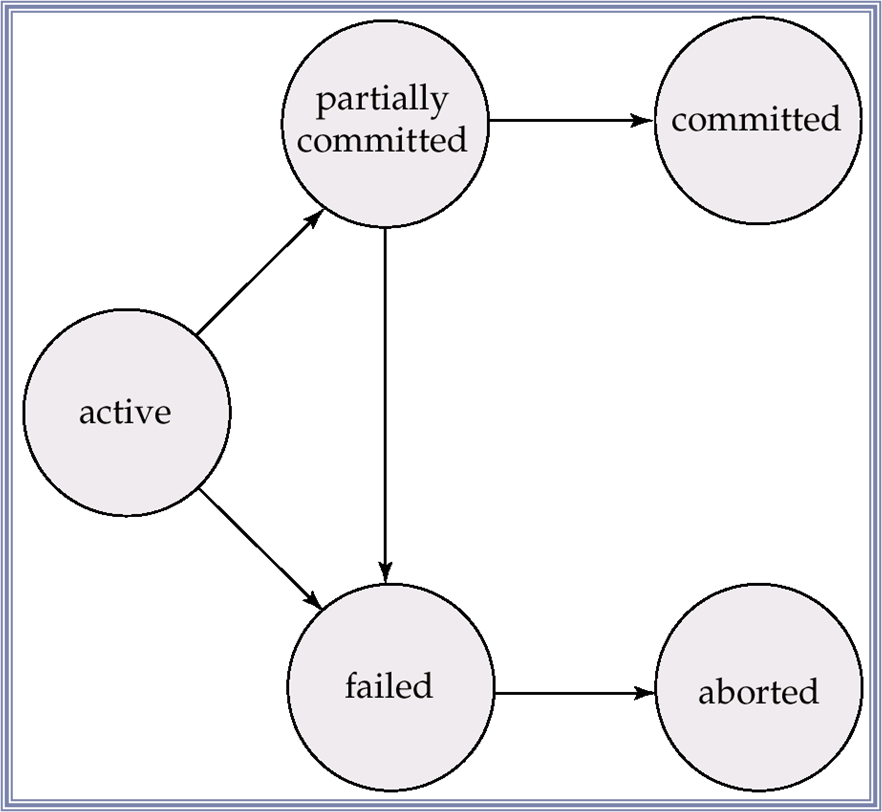

# 의미
Data item을 Access 하거나 Update 하는 Program Execution의 단위

# 목적
1. Consistency
   - Transaction을 Execution하는 동안 Database가 Inconsistent할 수 있음
   - Transaction이 Commit된 시점에서 Database는 Consistent함
   - 해결해야 하는 문제들
     1. Hardware Failure, System Crash를 비롯한 Failure
     2. 여러 Transaction을 Execute 함에 따른 Concurrent

# 상태
1. Active - 초기 상태
2. Partially Committed - 마지막 statement 실행 후
3. Failed - 정상 Execution 불가 발견 시
4. Aborted - Rollback 및 초기 상태 복원 후
5. Committed - 성공적으로 완료

